### `andrXco@github ~ $ ./contributions.sh`

 
 

### `andrXco@github ~ $ ./profile.sh`

 
 

### `andrXco@github ~ $ ./connect.sh`

<!--
  Keep the profile details in data/profile.json, then run:
    python scripts/render_profile_card.py
  Contributions are refreshed automatically by GitHub Actions.
-->
